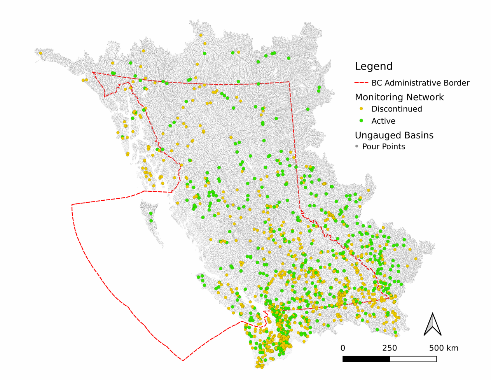

# BC Streamflow Monitoring Optimization

A common use of streamflow data is to estimate volume and timing of streamflow no observations exist.  A number of different model approaches are used, such as process-based, conceptual, empirical, and machine learning.  The accuracy of these models is dependent on the quality and quantity of the observed data.  But hydrological models of any kind require long-term observations in the order of decades, so for today's studies we have only a limited number of locations with sufficient data, where the locations themselves were established in previous decades based upon different information priorities.  The result is that the locations of streamflow monitoring stations are not necessarily optimal for the needs of today or the future.  

In this project we look at streamflow monitoring network optimization through the lens of information theory.  We use the concept of surprise to quantify the information content of a streamflow observation, and we use the concept of expected surprise reduction to quantify the information content of a potential monitoring location.  We then use a greedy network expansion algorithm to find the location(s) that maximize the expected total reduction in surprise for the set of all ungauged locations.  In other words, we find the ungauged location(s) that provide the most (expected) reduction in uncertainty for the ungauged space.

The project is implemented in Python, and the general methodology is as follows:

* **setup**: set up the project, including downloading data and setting up the Python environment
* **data preproccessing**: prepare the data for analysis
* **analysis**: perform the analysis
* **results**: summarize the results

## Getting Started

Clone this repo and collect the required input data.  The project is implemented in Python, and the required packages are listed in `requirements.txt`.  

### Prerequisites

To perform a network optimization, the following is required:

* **Streamflow monitoring data**: we use the HYSETS dataset (Arsenault, 2019) to represent the active and discontinued streamflow monitoring network in BC.  This dataset is used to develop a model to map the information content of basin attributes to the expected divergence of the streamflow distribution from the prior distribution.  The HYSETS dataset is available from the [Open Science Foundation data repository](https://osf.io/rpc3w/) and should be retrieved and saved to disk.
* **British Columbia Ungauged Basins**: monitoring network optimization requires characterization of a decision space of potential monitoring locations.  We use the British Columbia Ungauged Basins (BCUB) dataset (citation?) to represent the decision space for BC hydrometric monitoring.  The BCUB is a set of attributes describing the terrain, soil, land cover, and climate for a very large set of ungauged locations.  The BCUB dataset is available from the [Open Science Foundation data repository](https://osf.io/6p7ae/) and should be retrieved and saved to disk, or an alternate set of basins and attributes can be used to apply the method to a different region of interest.  

For information on the development of BCUB, see the [BCUB repository](https://github.com/dankovacek/bcub).  For a more detailed walkthrough of how to process attributes for a new region of interest, see the [BCUB demo repository](https://github.com/dankovacek/bcub_demo).

## Study Region

In the figure above, the British Columbia adminstrative boundary (red dashed line) represents the decision space within which streamflow monitoring network decisions can be made.  Also shown are active (green dots) and discontinued (orange dots) streamflow monitoring locations.  A buffer extends the study region bounds extend beyond the BC administrative border to incorporate trans-boundary basins and other adjacent regions (by basin) that are close in space to the border that may contain information relevant to the decision space.  Additionally, the buffer mitigates edge effects of the decision space boundary on the optimization algorithm.  

## Data Preprocessing

The data preprocessing steps includes adding columns to the ungauged basin dataset to describe baseline distances and expected surprise reduction.  

### Baseline Distances

Calculate the baseline distances from each ungauged location to the nearest active monitoring location.  This is used as a basis of comparison for the network optimization.  The "baseline distance" is mapped to the expected surprise reduction using the model developed in the analysis step.  The baseline distance represents the expected divergence between the streamflow distribution at the ungauged location and the prior distribution, represented by streamflow mapped from an active monitoring station "most similar" to each ungauged location.  The baseline distance for each ungauged location is calculated using the `calc_baseline_distances.py` script.

